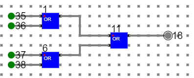

# Components Required:

To build any 4 bit ALU, we need :
1. AND gate, OR gate, XOR gate
2. Full Adder
3. 4-to-1 MUX
4. Wires to connect.
In case of counters the number of flip-flops depends on the number of different states in the counter.

## Circuit of 3 input AND Gate:

## Circuit of 4 input OR gate Gate:

## Circuit of 4:1 Multiplexer using NAND Gate:

## Circuit of Full Adder:

## Circuit of 1-bit ALU:

- Follow the below manual and perform the experiment
    - Manual --> [Click Here](./simulation/coavlNew.pdf)

<embed src="./simulation/coavlNew.pdf" type="application/pdf">

