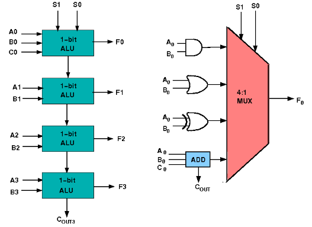
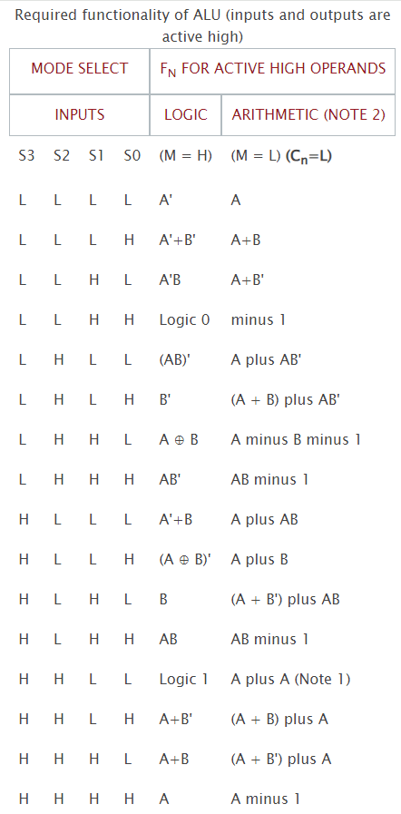

### Theory

## Design of ALU

ALU or Arithmetic Logical Unit is a digital circuit to do arithmetic operations like addition, subtraction,division, multiplication and logical oparations like and, or, xor, nand, nor etc. A simple block diagram of a 4 bit ALU for operations and,or,xor and Add is shown here :

The 4-bit ALU block is combined using 4 1-bit ALU block

## Design Issues:

The circuit functionality of a 1 bit ALU is shown here, depending upon the control signal S1 and S0 the circuit operates as follows: 
for Control signal <b>S1 = 0</b> , S0 = 0, the output is <b>A And B</b>, 
for Control signal <b>S1 = 0</b> , S0 = 1, the output is <b>A Or B</b>, 
for Control signal <b>S1 = 1</b> , S0 = 0, the output is <b>A Xor B</b>, 
for Control signal <b>S1 = 1</b> , S0 = 1, the output is <b>A Add B</b>. 

## The truth table for 16-bit ALU with capabilities similar to 74181 is shown here:

The L denotes the logic low and H denotes logic high.